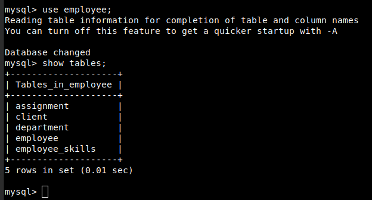
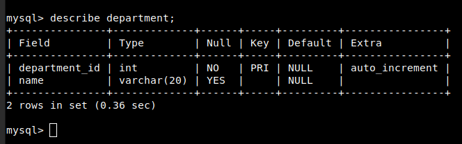

# **Tutorial MySQL: Uma Introdução Objetiva aos Fundamentos do Banco de Dados MySQL**

## Capítulo 4 - Como criar banco de dados, tabelas e índices

### SQL significa Structured Qurey Language

- É a linguagem usada para a criação e consulta de banco de dados relacionais.

### Data Definition Language ou DDL

- É a Linguagem de Definição de Dados, utilizada para criação das estruturas do banco de dados.

### Data Manipulation Language ou DML

-É a Linguagem de Manipulação de Dados, utilizada para a manipulação do banco de dados.

## Letras maiúsculas e minúsculas

As palavras-chaves no SQL não levam em conta o case sensitive, ou seja, a diferença entre as letras maiúsculas e minúsculas.

No MySQL, o sistema operacional utilizado é que definirá se os nomes do banco de dados e das tabelas levarão em conta a diferença entre letras maiúsculas e minúsculas.

A razão disto é que, geralmente, cada banco de dados terá um diretório subjacente em seu sistema operacional e cada tabela terá um arquivo subjacente. Estes nomes  de diretórios e arquivos seguem regras que dependem do sistema operacional.

Para diminuir a confusão, é uma boa prática tratar todos os identificadores como case sensitive, mesmo que você esteja trabalhando em um sistema Windows. Isto permitirá trocar de uma plataforma para outra facilmente.

## Identificadores no MySQL

Um identificador é simplesmente o nome de um alias, um banco de dados, uma tabela, uma coluna ou um índice. É como você identifica com exclusividade este objeto.
Em geral os identificadores podem conter qualquer caractere, com estas exceções:

- Eles não podem conter caracteres de aspas, ASCII(0) e ASCII(255).
- Os nomes do banco de dados podem conter qualquer caractere permitido em um nome de diretório, mas não os caracteres que possuem um significado especial em nome de diretório (`/`, `\` e `.`) por razões óbvias.
- Os nomes da tabela podem conter qualquer caractere permitido nos nomes de arquivo, exceto `.` e `/`.

Todos os identificadores, exceto os alias, podem ser configurados para terem 64 caracteres de comprimento. Os nomes de alias podem ter até 255 caracteres de comprimento.

## Como criar um banco de dados

Fazemos isso com a instrução SQL ``CREATE DATABASE``

```sql
create database nomedatabase;
```

Podemos verificar se a instrução funcionou corretamente executando o comando

```sql
show databases;
```

## Como selecionar um banco de dados

Antes de criar uma tabela ou fazer qualquer coisa com o banco de dados, precisamos informar ao MySQL que desejamos trabalhar com ele. Fazemos isto com a instrução `use`:

```sql
use nomedatabase
```

O banco de dados _**nomedatabase**_ agora está selecionado e todas as ações que tomarmos de agora em diante serão aplicadas nele, por padrão.

## Como criar tabelas

Para criarmos uma tabela, usamos a instrução SQL ``CREATE TABLE``. A forma usual desta instrução é:

```sql
create table nometabela ( definição tabela ) [ type = tipo_tabela ];
```

Ou seja, começamos com as palavras `create table`, seguimos com o nome desejado para a tabela e continuamos com um conjunto de definições de colunas. No final da instrução, podemos especificar, opcionalmente, o tipo de mecanismo de armazenamento desejado.

### Exemplo de criação da tabela

```sql
drop database if exists employee;
create database employee;

use employee;

create table department
(
department_id int not null auto_increment primary key,
name varchar(20)
) ENGINE=InnoDB;

create table employee
(
employee_id int not null auto_increment primary key,
name varchar(80),
job varchar(15),
department_id int not null references department(department_id)
) ENGINE=InnoDB;

create table employee_skills
(
employee_id int not null references employee(employee_id),
skill varchar(15) not null,
primary key (employee_id, skill)
) ENGINE=InnoDB;

create table client
(
client_id int not null auto_increment primary key,
name varchar(40),
address varchar(100),
contact_person varchar(80),
contact_number char(12)
) ENGINE=InnoDB;

create table assignment
(
client_id int not null references client(client_id),
employee_id int not null references employee(employee_id),
workdate date not null,
hours float,
primary key (client_id, employee_id, workdate)
) ENGINE=InnoDB;
```

Obs.: O script original utilizava `type=InnoDB` ao invés de `ENGINE=InnoDB`, que é suportada pela versão atual do MySQL.

### Analisando as instruções SQL neste arquivo uma a uma

Começamos com:

```sql
drop database if exists employe;
```

Esta instrução verifica se um banco de dados chamado ``employee`` já existe. Se existir, a instrução irá apagá-lo. Isto não é estritamente necessário e ainda pode ser perigoso. Note que se você usar o MySQL em um ambiente de hospedagem de sites, por exemplo, a empresa responsável pela hospedagem poderá desativar o comando ``drop database``.

Agora começaremos a criar as tabelas dentro deste banco de dados. Vamos criar a tabela ``department``, como a seguir:

```sql
create table department
(
department_id int not null auto_increment primary key,
name varchar(20)
) ENGINE=InnoDB;
```

Para criar as colunas na tabela, fornecemos uma lista separada por vírgula das declarações da coluna entre parênteses. Note que os atributos de uma coluna não precisam ser separados por vírgula, apenas as colunas em si.

Em geral, nas instruções ``CREATE`` temos a tendência de colocar um item em cada linha para aumentar a legibilidade.

Nesta tabela, estamos declarando duas colunas. Cada declaração da coluna começa com o nome da coluna, seguido de informações sobre seu tipo.

Para facilitar nosso entendimento, vamos ver primeiro a segunda coluna, onde é declarado o nome do departamento: ``name varchar (20)``.

Esta declaração informa que a coluna será chamada ``name`` e que seu tipo é ``varchar(20)``. O tipo ``varchar`` é uma string com comprimento variável, neste caso, com até 20 caracteres. Também poderíamos ter usado ``char``, que é uma string com comprimento fixo. Escolher ``varchar`` ou  ``char`` não faz diferença em relação uso dos dados, mas no modo como os dados são armazenados na memória. Uma coluna do tipo ``varchar(20)`` ocupa tanto espaço quanto o número de caracteres armazenados nela, ao passo que **uma coluna do tipo ``char(20)`` tem sempre 20 caracteres de largura, independente do que está armazenando.**

Agora, vejamos a definição da primeira coluna: `departmentID int not null auto_increment primary key;`.

O nome desta coluna é `departmentID`, é do tipo `int` (inteiro) e representa um número exclusivo, que usaremos para identificar cada departamento da empresa.

Depois do tipo, temos outras informações sobre a coluna. Primeiro, especificamos que esta coluna é `not null`, em outras palavras, para cada linha nesta tabela, esta coluna deverá possuir um valor.

Em segundo lugar, especificamos que esta coluna é uma coluna `auto_increment`. Este é um recurso interessante no MySQL. Quando inserimos dados nesta tabela, se um número de departamento não for especificado, o MySQL alocará um único número exclusivo, que será o próximo número na sequência `auto_increment`.

Finalmente, especificamos através de primary key que esta coluna será a chave primária desta tabela. Se a chave primária consistir em uma única coluna, poderemos especificá-la desta forma, juntamente com as demais informações da coluna. Para chaves primárias com diversas colunas usaremos uma declaração diferente.

Esta é a definição da tabela. Agora, vejamos o final da instrução SQL. Depois do parêntese final, você verá a linha seguinte: `ENGINE=InnoDB`.

Isto especifica que esta tabela deve usar o mecanismo de armazenamento `InnoDB`. Se você examinar as definições das tabelas do exemplo, verá que declaramos todas as  tabelas como tabelas `InnoDB`.

Neste caso, estamos usando `InnoDB` porque trabalharemos com alguns exemplos usando chaves estrangeiras. O mecanismo de armazenamento `InnoDB` suporta chaves estrangeiras e transações, ao passo que o tipo `MyISAM` não. No entanto, o tipo de tabela `MyISAM` é geralmente mais rápido que o `InnoDB`. É necessário decidir qual o tipo é melhor para cada tabela.

Também poderiamos criar tabelas de tipos diferentes tendo, por exemplo, algumas tabelas `InnoDB` e algumas tabelas `MyISAM` (e se necessário, de outros tipos).

Agora, vejamos a segunda instrução `create table`:

```sql
create table employee
(
employee_id int not null auto_increment primary key,
name varchar(80),
job varchar(15),
department_id int not null references department(department_id)
) ENGINE=InnoDB;
```

Há apenas uma nova parte na sintaxe desta instrução. A última coluna na tabela `employee` é o identificador do departamento no qual os funcionários trabalham. Esta é uma chave estrangeira. Esta declaração é feita através da cláusula `references`, como a seguir: `departmentID int not null references department(departmentID)` isto informa que a coluna `departmentID` da tabela `employee` é uma referência à coluna `departmentID` da tabela `department`.

Note que podemos usar a sintaxe de chave estrangeira porque a tabela `employee` é uma tabela do tipo `InnoDB`. Quando usamos tabelas do tipo `MyISAM`, não podemos usar este recurso.

Agora, vejamos a segunda instrução `create table`:

```sql
create table employee_skills
(
employee_id int not null references employee(employee_id),
skill varchar(15) not null,
primary key (employee_id, skill)
) ENGINE=InnoDB;
```

Nesta tabela temos novamente uma chave estrangeira, neste caso, `employeeID`. O interessante na definição desta tabela é a chave primária com duas colunas. Você pode ver que declaramos as duas colunas na tabela, `employeeId` e `skill`. A chave primária, contendo as duas colunas, é declarada separadamente na linha: `primary key (employeeID, skill)`.

As outras definições da tabela não contém nenhuma sintaxe nova, portanto, não iremos percorrê-las em detalhes.

Podemos verificar se as tabelas em nosso banco de dados foram configuradas corretamente usando o comando:

```sql
show tables;
```

Deveremos obter a seguinte saída:



É possível ainda, obter mais informações sobre a estrutura de cada tabela usando o comando `describle`. Por exemplo:

```sql
describle department;
```

Deveremos obter a seguinte saída:



## Instrução CREATE TABLE

Coming soon