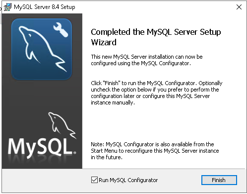
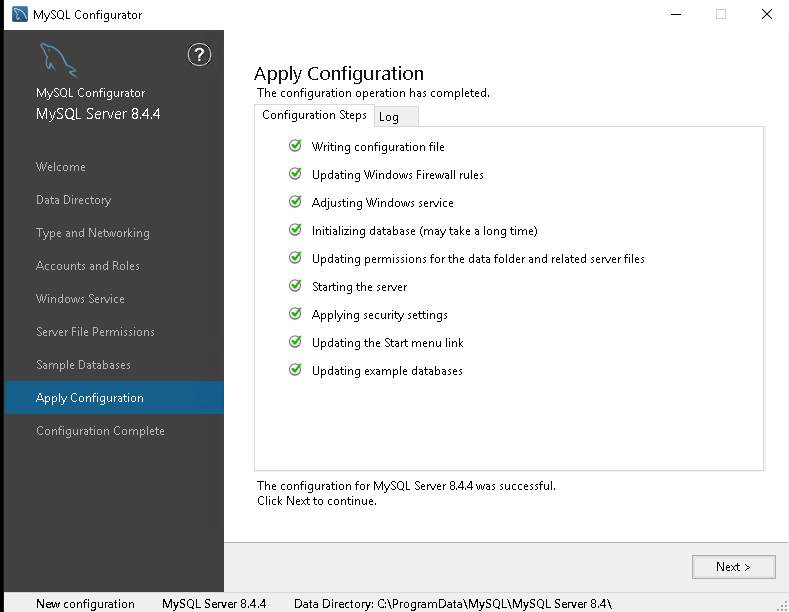
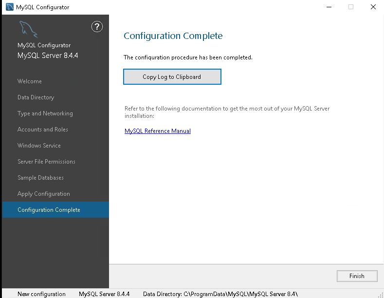
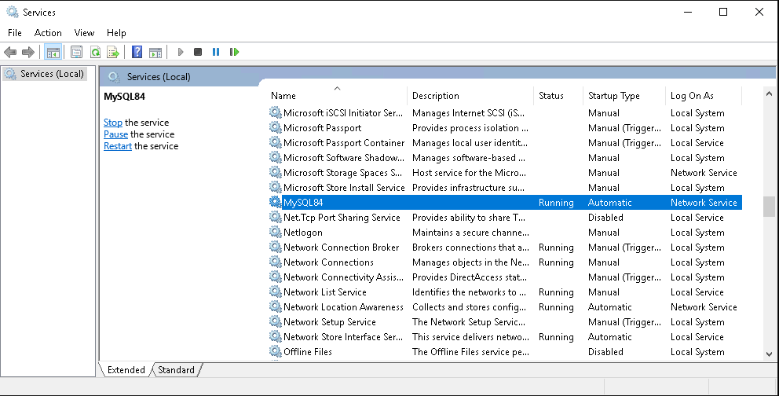
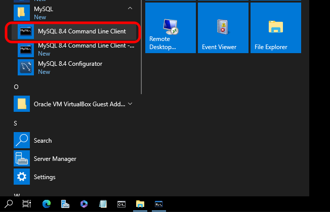
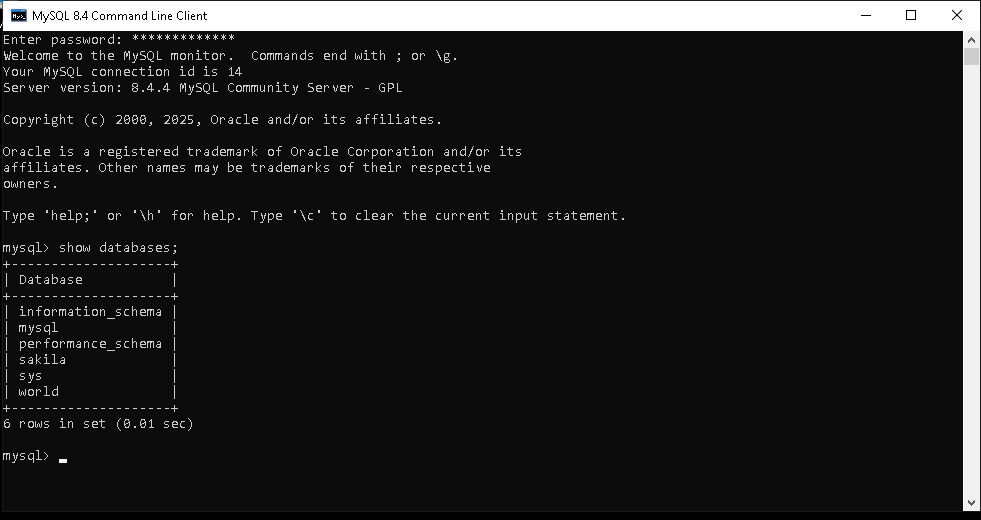

# **Training Leitura Livro - MySQL Tutorial: Uma Introdução Objetiva aos Fundamentos do Banco de Dados MySQL**

## Configuração Laboratório Treinamento

### Processo de criação da VM Linux

1. Registrar no Controle VirtualBox (Planilha Apontamentos, Guia VirtualBox)
2. Definir IP fixo ou DHCP
3. Clonar com base em um Template
4. Ajustar informações na Descrição da VM
5. Iniciar a VM em modo Headless
6. Conectar na VM via SSH utilizando etiqueta do Template
7. Ajustar IP em `ConfigurarRedeComIpFixo.sh`
8. Executar `ConfigurarRedeComIpFixo.sh` para efetivar alteração do IP
9. Criar entrada no Remmina para a VM
10. Renomear o hostname
11. Efetuar update & upgrade
12. Efetuar Snapshot para evitar retrabalhos

## Instalação do MySQL no Linux

### Download do MySQL

- [Link para Página de Download MySQL](https://dev.mysql.com/downloads/mysql/)

- Versão baixada: 8.4.3 LTS "DEB Bundle" para Ubuntu 20.04 (inclui todos os pacotes necessários).

### Checksums

- Site:

```text
8e645a96ce624fa9cf0bc8adc487422c
```

- Verificar checksum do arquivo baixado:

```bash
md5sum mysql-server_8.4.3-1ubuntu24.04_amd64.deb-bundle.tar
```

- Retorno esperado:

```text
8e645a96ce624fa9cf0bc8adc487422c
```

### Transferindo o arquivo baixado para a VM

#### No Host

```bash
scp mysql-community-server_8.4.3-1ubuntu24.04_amd64.deb username@192.168.0.xxx:/tmp
```

#### Na VM

```bash
cd /tmp
mv mysql-server_8.4.3-1ubuntu24.04_amd64.deb-bundle.tar /home/username/
cd /home/username/
```

### Instalação

Baseado no passo a passo descrito em:

- [Guia de Instalação](https://dev.mysql.com/doc/refman/8.4/en/linux-installation-debian.html)

Como eu fiz:

```bash
cd /home/username/
tar -xvf mysql-server_8.4.3-1ubuntu24.04_amd64.deb-bundle.tar
sudo apt-get install libaio1
sudo dpkg-preconfigure mysql-community-server_*.deb
sudo dpkg -i mysql-{common,community-client-plugins,community-client-core,community-client,client,community-server-core,community-server,server}_*.deb
sudo apt-get -f install
# Definir senha para root: Minh@Senh@123
sudo reboot
sudo systemctl status mysql
```

### Primeira conexão

```bash
mysql -u root -p
# Senha: Minh@Senh@123
```

### Criar usuário: `username`

**Sintaxe:**

1. **Criar o usuário**

```sql
CREATE USER 'username'@'%' IDENTIFIED BY 'MinhaSenha123';
```

2. **Conceder privilégios**

```sql
GRANT CREATE, CREATE TEMPORARY TABLES, DELETE, EXECUTE, INDEX, INSERT, LOCK TABLES, SELECT, SHOW DATABASES, UPDATE ON *.* TO 'username'@'%';
```

3. **Aplicar mudanças**

```sql
FLUSH PRIVILEGES;
```

4. **Testar o acesso**

```bash
mysql -u username -p
# Senha: MinhaSenha123
```

---

### Processo de criação da VM Windows

1. Registrar no Controle VirtualBox (Planilha Apontamentos, Guia VirtualBox)
2. Definir IP fixo ou DHCP
3. Clonar com base em um Template
4. Ajustar informações na Descrição da VM
5. Iniciar a VM em modo Headless
6. Conectar na VM via RDP utilizando etiqueta do Template
7. Ajustar IP em Windows Settings, Networking & Internet, Change Adapters Options, clique com o botão direito sobre a placa de rede e em seguida em Propriedades, procure por Internet Protocol Version 4 (TCP/IPv4) e faça os ajustes
8. Criar entrada no Remmina para a VM
9. Renomear o hostname
10. Efetuar Windows Update
11. Efetuar Snapshot para evitar retrabalhos

## Instalação do MySQL no Windows

### Download do MySQL

- [Link para Página de Download MySQL](https://dev.mysql.com/doc/refman/8.4/en/windows-installation.html)

- Versão baixada: MySQL Installer 8.0.41.

### Checksums

- Site:

```text
c2e89b80cf89c2214e5ecb9f91b77f10
```

- Verificar checksum do arquivo baixado:

```bash
md5sum mysql-installer-community-8.0.41.0.msi
```

- Retorno esperado:

```text
c2e89b80cf89c2214e5ecb9f91b77f10
```

### Instalação

Baseado no passo a passo descrito em:

- [Guia de Instalação](https://dev.mysql.com/doc/refman/8.4/en/windows-installation.html)

Como eu fiz:

1. Pasta Downloads
2. Duplo clique no arquivo baixado (mysql-8.4.4-winx64.msi)
3. Aceitar os termos da Licença
4. Escolher entre os tipos de instalação:
  - Typical (padrão): Recomendado para a maioria dos usuários, instala os recursos mais comuns do programa.
  - Custom (customizada): Permite que os usuários alterem quais recursos do programa serão instalados e onde serão instalados. Recomendado para usuários avançados.
  - Complete (completa): Todos os recursos do programa serão instalados. Requer mais espaço em disco.
  Para a primeira parte dos meus estudos vou escolher a "Typical".
5. Uma tela de confirmação do tipo de instalação é exibida, clicar em next para prosseguir.
6. Na próxima tela é exibido o progresso da instalação e na sequência uma tela de confirmação de execução com sucesso da instalação do MySQL.
  - 
7. Essa tela também permite que seja executado o MySQL Configurator, confirmei a execução.
8. Execução do MySQL Configurator:
  - Data Directory:
    

  - Type and Networking
    

  - Accounts and Roles  
    

  - Windows Service
    
  
  - Server File Permissions
    

  - Sample Databases
    

  - Apply Configuration
    

  - Apply Configuration Successful
    

  - Configuration Complete
    

9. Serviço do MySQL Server em execução
  

### Primeira conexão

Executar o "MySQL 8.4 Command Line Client que foi criado no Grupo de Programas MySQL:
  

Listar Databases existentes:
  

---

#### Próximos passos
