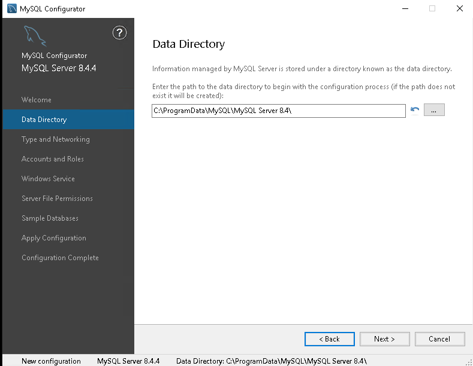
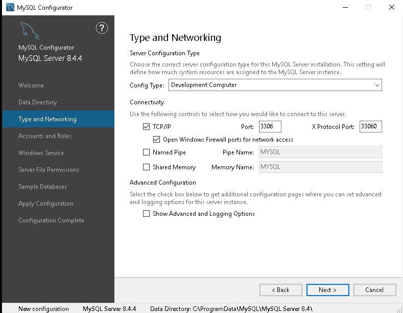
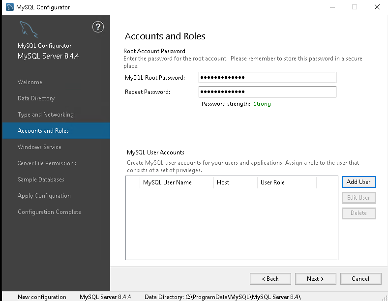
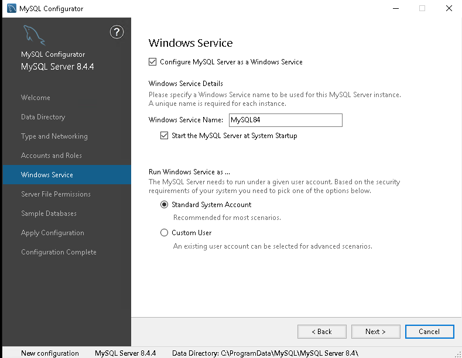
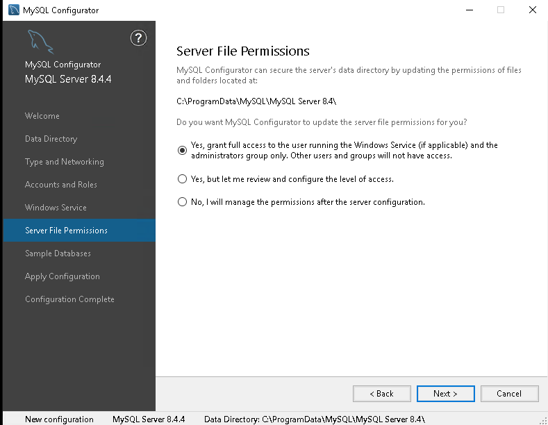
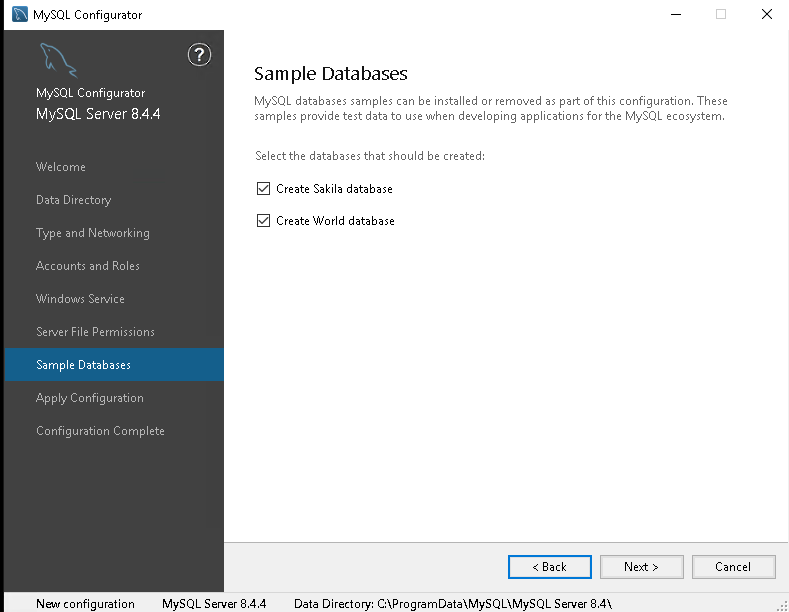
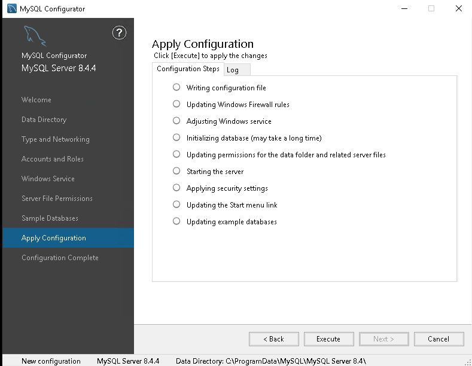

# **Training Livro - MySQL Tutorial: Uma Introdução Objetiva aos Fundamentos do Banco de Dados MySQL**

## **Configuração do Laboratório de Estudo - MySQL Server**

Este documento detalha o processo de criação de um laboratório para estudo do MySQL Server, cobrindo instalação e configuração tanto em um servidor Linux Ubuntu Server 24.04.1 LTS quanto em um servidor Windows Server 2019 Evaluation Edition. O objetivo é fornecer um guia prático para preparação do ambiente necessário aos estudos.

---

## Parte 1: Configuração no Servidor Linux Ubuntu

### Processo de Criação da VM Linux

1. Registrar a VM no Controle VirtualBox (Planilha Apontamentos, Guia VirtualBox).
2. Configurar IP fixo ou via DHCP.
3. Clonar a VM com base em um Template preexistente.
4. Atualizar as informações na descrição da VM.
5. Iniciar a VM em modo Headless.
6. Conectar à VM via SSH utilizando as credenciais do Template.
7. Configurar o IP: ajustar o script `ConfigurarRedeComIpFixo.sh`.
8. Criar uma entrada no Remmina para acesso remoto.
9. Renomear o hostname.
10. Atualizar o sistema:  `sudo apt update && sudo apt upgrade -y`.
11. Criar um Snapshot da VM para evitar retrabalhos em caso de problemas futuros. Certifique-se de que todas as atualizações e configurações iniciais estejam completas antes de criar o Snapshot, para garantir um ponto de recuperação confiável.

### Instalação do MySQL no Linux

#### Download do MySQL

- **Link para página de download:** [MySQL Downloads](https://dev.mysql.com/downloads/mysql/).
- **Versão utilizada:** 8.4.3 LTS "DEB Bundle" para Ubuntu 20.04.

#### Verificação do Checksum

- **Checksum do site:**

```text
8e645a96ce624fa9cf0bc8adc487422c
```

- **Comando para verificação:**

```bash
md5sum mysql-server_8.4.3-1ubuntu24.04_amd64.deb-bundle.tar
```

- **Resultado esperado:**

```text
8e645a96ce624fa9cf0bc8adc487422c
```

#### Transferência do Arquivo para a VM

Execute no host:

```bash
scp mysql-server_8.4.3-1ubuntu24.04_amd64.deb-bundle.tar username@192.168.0.xxx:/tmp
```

Execute na VM:

```bash
cd /tmp
mv mysql-server_8.4.3-1ubuntu24.04_amd64.deb-bundle.tar /home/username/
cd /home/username/
```

#### Instalação do MySQL

Baseado no guia oficial de instalação: [Guia de Instalação MySQL](https://dev.mysql.com/doc/refman/8.4/en/linux-installation-debian.html).

Passos executados:

```bash
tar -xvf mysql-server_8.4.3-1ubuntu24.04_amd64.deb-bundle.tar
sudo apt-get install libaio1
sudo dpkg-preconfigure mysql-community-server_*.deb
sudo dpkg -i mysql-{common,community-client-plugins,community-client-core,community-client,client,community-server-core,community-server,server}_*.deb
sudo apt-get -f install
```

Durante a instalação, defina uma senha segura para o usuário root.

Reinicie o sistema e verifique o status do serviço:

```bash
sudo reboot
sudo systemctl status mysql
```

#### Primeira Conexão

Acesse o MySQL:

```bash
mysql -u root -p
# Insira a senha definida.
```

#### Criação de um Usuário

1. Criar o usuário:

```sql
CREATE USER 'username'@'%' IDENTIFIED BY '<SENHA_FORTE>';
```

2. Conceder privilégios:

```sql
GRANT ALL PRIVILEGES ON *.* TO 'username'@'%';
```

3. Aplicar mudanças:

```sql
FLUSH PRIVILEGES;
```

4. Testar o acesso:

```bash
mysql -u username -p
# Insira a senha definida.
```

---

## Parte 2: Configuração no Servidor Windows 2019

### Processo de Criação da VM Windows

1. Registrar a VM no Controle VirtualBox (Planilha Apontamentos, Guia VirtualBox).
2. Configurar IP fixo ou via DHCP.
3. Clonar a VM com base em um Template preexistente.
4. Atualizar as informações na descrição da VM.
5. Iniciar a VM em modo Headless.
6. Conectar à VM via RDP utilizando as credenciais do Template.
7. Configurar o IP no painel "Configurações de Rede" (procurar pelo protocolo IPv4 e ajustar conforme necessário).
8. Criar uma entrada no Remmina para acesso remoto.
9. Renomear o hostname.
10. Atualizar o sistema via Windows Update.
11. Criar um Snapshot da VM para evitar retrabalhos em caso de problemas futuros. Certifique-se de que todas as atualizações e configurações iniciais estejam completas antes de criar o Snapshot, para garantir um ponto de recuperação confiável.

### Instalação do MySQL no Windows

#### Download do MySQL

- **Link para página de download:** [MySQL Downloads](https://dev.mysql.com/doc/refman/8.4/en/windows-installation.html).
- **Versão utilizada:** MySQL Installer 8.0.41.

#### Verificação do Checksum

- **Checksum do site:**

```text
c2e89b80cf89c2214e5ecb9f91b77f10
```

- **Comando para verificação:**

```bash
md5sum mysql-installer-community-8.0.41.0.msi
```

- **Resultado esperado:**

```text
c2e89b80cf89c2214e5ecb9f91b77f10
```

#### Instalação do MySQL

1. Navegue até a pasta "Downloads".
2. Execute o instalador baixado.
3. Aceite os termos de licença.
4. Escolha o tipo de instalação:
   - **Typical**: Instala os componentes mais comuns, ideal para a maioria dos casos iniciais e recomendado para novos usuários.
   - **Custom**: Permite escolher quais componentes instalar e onde armazená-los, ideal para usuários avançados ou configurações específicas.
   - **Complete**: Instala todos os componentes disponíveis, ocupando mais espaço em disco, mas fornecendo o máximo de recursos possíveis.
5. Prossiga com a instalação e aguarde a conclusão.
6. Execute o MySQL Configurator para ajustar as configurações, com base nas seguintes telas e impactos:
   - **Data Directory**: Define o local de armazenamento dos arquivos de dados. Alterar esse caminho pode ser útil para ambientes com particionamento específico ou discos de alto desempenho.
     
   - **Type and Networking**: Permite escolher o tipo de servidor (Standalone, Clustered) e ajustar as configurações de rede. Para estudos iniciais, escolha "Standalone" e configure a porta padrão 3306.
     
   - **Accounts and Roles**: Configuração de contas de administrador. Certifique-se de definir uma senha segura para o usuário root.
     
   - **Windows Service**: Define o MySQL como um serviço do Windows, permitindo inicialização automática.
     
   - **Server File Permissions**: Permite ajustar permissões para maior segurança no acesso aos arquivos do servidor.
     
   - **Sample Databases**: Instala bases de dados de exemplo para exploração inicial. Útil para testes e aprendizado.
     
   - **Apply Configuration**: Aplica todas as configurações e valida o sucesso da instalação.
     

#### Primeira Conexão

Use o cliente MySQL instalado para conectar-se ao servidor e testar o acesso.

---

#### Próximos passos 


[def]: ./images/TelaAccountsAndRoles.png